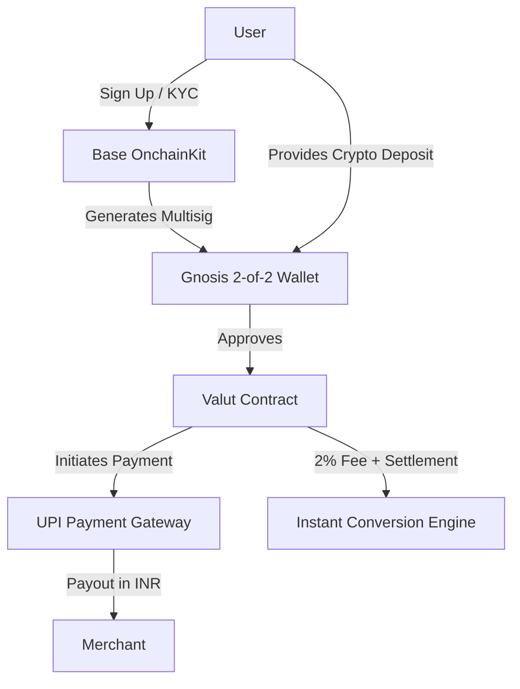
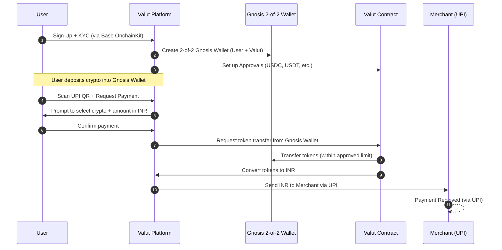

# Valut Tech Documentation

Welcome to the Valut technical documentation. This guide provides a comprehensive overview of how Valut allows users to pay with crypto anywhere UPI is accepted in India. Below, you'll learn about the architecture, flow, and technical mechanics that make Valut possible.

---

## Table of Contents
1. [Introduction](#introduction)
2. [Key Features](#key-features)
3. [System Architecture](#system-architecture)
   - [Base OnchainKit Integration](#base-onchainkit-integration)
   - [Multisig Wallet Creation](#multisig-wallet-creation)
   - [Valut Contract Approvals](#valut-contract-approvals)
4. [High-Level Architecture Diagram](#high-level-architecture-diagram)
5. [Payment Flow](#payment-flow)
   - [Step-by-Step Sequence Diagram](#step-by-step-sequence-diagram)
6. [Security Considerations](#security-considerations)
7. [FAQ](#faq)
8. [Conclusion](#conclusion)

---

## Introduction

Valut bridges the gap between cryptocurrencies and India's UPI (Unified Payments Interface) system. By leveraging Valut, users can:

- Use crypto to pay on any UPI QR code in India
- Experience instant settlement with transparent fees (2% flat per transaction)
- Seamlessly integrate within existing UPI infrastructure—merchants are paid in INR, with no changes needed on their end

Key value proposition:
- **"One Simple Flow: Scan, Select, Pay"** – just scan a UPI code, select the crypto you want to use, and approve the payment
- **"Finally use your crypto for everyday purchases"** – from restaurants to utility bills, any merchant accepting UPI can now indirectly accept crypto

---

## Key Features

1. **Real-World Utility**  
   Pay with crypto while the merchant seamlessly receives INR just like a normal UPI transaction.

2. **Seamless Integration**  
   No waiting for blockchain confirmations or complicated flows. You just scan and pay.

3. **Instant Settlement**  
   Crypto-to-fiat conversions happen behind the scenes, and the merchant is paid almost instantly in INR.

4. **Transparent Pricing**  
   Valut charges a fixed 2% fee on each transaction—simple and transparent, with no hidden costs.

5. **Regulatory Compliance**  
   Built with KYC/AML procedures to ensure compliance with Indian financial regulations.

---

## System Architecture

Valut's core architecture centers around a secure multisig wallet for each user, combined with a smart contract that has pre-approved access to necessary tokens for settlement.

### Base OnchainKit Integration
- Users sign up on the Valut platform, which uses Base OnchainKit for wallet generation and key management
- OnchainKit handles user identity verification (KYC/AML) and ensures compliance with Indian regulations
- The integration provides a secure, non-custodial foundation for the platform

### Multisig Wallet Creation
- Upon user registration, Valut automatically creates a dedicated 2-of-2 Gnosis Safe Multisig wallet
  - **Signers**: The user and Valut
  - This multisig architecture ensures that neither party can unilaterally move funds
  - The wallet securely holds the user's crypto assets until they're needed for transactions

### Valut Contract Approvals
- During wallet setup, the user grants approval for the Valut smart contract to "pull" supported tokens (USDC, USDT, etc.) from the Gnosis Multisig
- This **pre-approval mechanism** eliminates the need for a 2-of-2 on-chain transaction every time a UPI payment is executed
  - Reduces gas costs
  - Makes payments instantaneous from the user perspective
  - Sets spending limits for enhanced security
- When a UPI payment is initiated, Valut uses these approved privileges to move the required tokens for conversion into INR
- The INR is then routed to the merchant via India's UPI payment system

---

## High-Level Architecture Diagram

### Component Explanation:
- **User**: A Valut user depositing and spending crypto
- **Base OnchainKit**: Manages wallet creation, KYC, and AML processes
- **Gnosis 2-of-2 Wallet**: Shared control between user and Valut for enhanced security
- **Valut Contract**: Holds privileged approval to move user assets for settlement within predefined limits
- **UPI Payment Gateway**: Facilitates INR transfer to merchant through India's UPI system
- **Merchant**: Receives INR like any normal UPI payment, with no crypto exposure
- **Instant Conversion Engine**: Valut's internal mechanism for converting crypto to INR at competitive rates

## Payment Flow

At the heart of Valut is a simple user experience: "Scan, Select, Pay." Here's how it works step by step:

### 1. Scan
- The user scans any merchant's UPI QR code with the Valut app
- The app decodes the merchant's UPI ID and payment details

### 2. Select
- The user chooses which cryptocurrency (e.g., BTC, ETH, USDT, USDC) to use for the payment
- The app displays the equivalent crypto amount (including the 2% fee) based on current exchange rates
- User confirms the INR amount to be paid

### 3. Pay
- Valut pulls the required tokens from the user's Gnosis multisig (using the pre-approved contract access)
- The tokens are instantly converted to INR through Valut's liquidity pools
- The payment is processed to the merchant's UPI ID through standard UPI rails

### 4. Settlement
- The merchant receives INR just like any normal UPI payment
- The user's crypto balance is reduced accordingly, with the 2% transaction fee applied
- Transaction receipt is provided to the user with complete transparency

### Step-by-Step Sequence Diagram

## Security Considerations

1. **Multisig Protection**
   - The 2-of-2 multisig ensures neither the user nor Valut can unilaterally access funds
   - Provides protection against account compromises

2. **Spending Limits**
   - Token approvals have configurable limits to reduce risk exposure
   - Users can set per-transaction and daily limits

3. **Liquidity Management**
   - Valut maintains sufficient INR liquidity to ensure payments can be processed quickly
   - Multiple liquidity sources to minimize slippage during crypto-to-INR conversion

4. **Regulatory Compliance**
   - Full KYC/AML procedures in line with Indian financial regulations
   - Transaction monitoring systems to detect suspicious activity

## FAQ

### How does Valut handle market volatility?
- Valut uses real-time exchange rates at the moment of transaction
- The rate is locked for 30 seconds while the user confirms the payment
- Valut's liquidity pools and risk management systems absorb short-term volatility

### What happens if a payment fails?
- If the UPI payment fails, the crypto is immediately returned to the user's wallet
- Users receive real-time notifications of transaction status

### Which cryptocurrencies are supported?
- USDC, USDT, ETH, and BTC initially
- Additional tokens will be added based on user demand and regulatory considerations

## Conclusion

Valut represents a significant step forward in bringing cryptocurrency utility to India's massive UPI ecosystem. By solving the crypto-to-fiat bridge in a seamless, compliant manner, Valut enables millions of crypto holders to use their assets for everyday purchases while respecting India's regulatory framework.